# Communication Architectures Project

Perform the technical design, configure and test a CDN network with multiple enterprise clients.
Authors:

* Gonçalo Silva, 103244, 50%
* João Ferreira, 103037, 50%

# Interconnection Network

For the interconnection network, we subdivided it into two masks:

* Point-to-point connections, are defined with **/30** or **255.255.255.252** mask
* Loopback interface have **/32** or **255.255.255.255** mask assigned

The network division can be viewed in the following table:

| Subnet | Network IP | Usable Range          | Broadcast IP | Mask |
| ------ | ---------- | --------------------- | ------------ | ---- |
| 1      | 10.0.0.0   | 10.0.0.1 - 10.0.0.2   | 10.0.0.3     | 30   |
| 2      | 10.0.0.4   | 10.0.0.5 - 10.0.0.6   | 10.0.0.7     | 30   |
| 3      | 10.0.0.8   | 10.0.0.9 - 10.0.0.10  | 10.0.0.11    | 30   |
| 4      | 10.0.0.12  | 10.0.0.13 - 10.0.0.14 | 10.0.0.15    | 30   |
| 5      | 10.0.0.16  | 10.0.0.17 - 10.0.0.18 | 10.0.0.19    | 30   |
| 6      | 10.0.0.20  | 10.0.0.21 - 10.0.0.22 | 10.0.0.23    | 30   |
| 7      | 10.0.0.24  | 10.0.0.25 - 10.0.0.26 | 10.0.0.27    | 30   |
| 8      | 10.0.0.28  | 10.0.0.29 - 10.0.0.30 | 10.0.0.31    | 30   |
| 9      | 10.0.0.32  | 10.0.0.33 - 10.0.0.34 | 10.0.0.35    | 30   |
| 10     | 10.0.0.36  | 10.0.0.37 - 10.0.0.38 | 10.0.0.39    | 30   |
| 11     | 10.0.0.40  | --                    | --           | 32   |
| 12     | 10.0.0.41  | --                    | --           | 32   |
| 13     | 10.0.0.42  | --                    | --           | 32   |
| 14     | 10.0.0.43  | --                    | --           | 32   |
| 15     | 10.0.0.44  | --                    | --           | 32   |
| 16     | 10.0.0.45  | --                    | --           | 32   |
| 17     | 10.0.0.46  | --                    | --           | 32   |
| 18     | 10.0.0.47  | --                    | --           | 32   |
| 19     | 10.0.0.48  | 10.0.0.49 - 10.0.0.50 | 10.0.0.51    | 30   |
| ...    | ...        | ...                   | ...          | ...  |

# Configuring the network

In this section, we'll be approaching the configuration of IP addresses and base routing protocols to achieve connectivity. Specific network and devices, including VPC's will be approached later.

## IP's

The layout of the network, as well as the assigned IP addresses for each interface and device can be viewed in the following image:
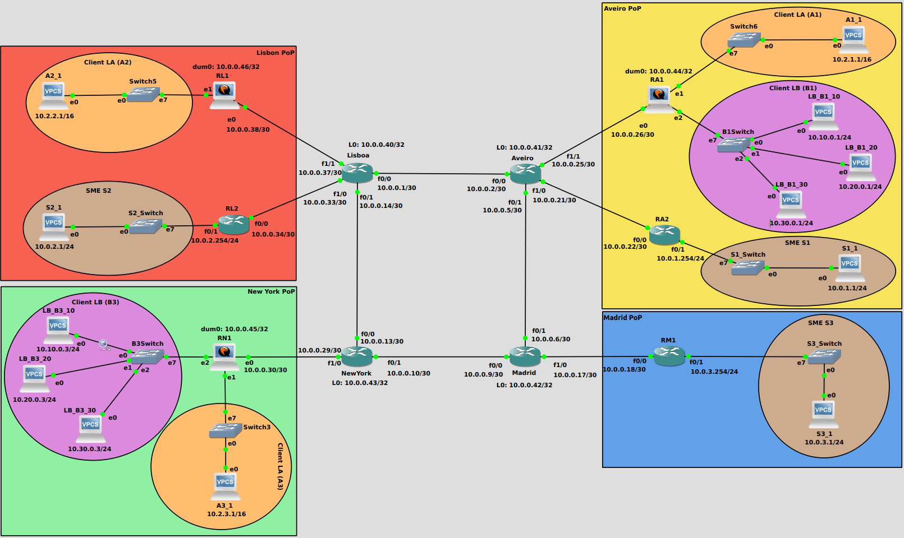

The IP addresses of the interconnection interfaces are derived from the division in the table above, and in the case of private or reserved network, only one address was needed to be assigned into a VPC.

To configure an interface IP address in a Cisco C7200, the following commands can be used:

* For serial interfaces:

```bash
interface <interface-type>/<interface-number>
ip addr <ip_address> <mask>
```

* For Loopback interfaces:

```bash
interface loopback <N>
ip addr <ip_address> <mask>
```

In the case of VyOS routers, the configuration is a bit different. When `N` is present in the command, it means that a number needs to be assigned to the interface:

* For serial interfaces:

```bash
configure
set interfaces ethernet ethN address <ip_address>/<mask>
set system host-name <router_name>
commit
save
```

* For Loopback interfaces:

```bash
configure
# Loopback/dummy interfaces need to be named dumN
set interfaces dummy dumN address <ip_address>/<maks>
commit
```

**NOTE:** Before configuring interfaces, check correct interfaces which are **eht0** - **eth5**, with the following command:

```bash
ip addr
```

If some of those interfaces aren't present, use the next command to load them:

```bash
sudo cp /opt/vyatta/etc/config.boot.default /config/config.boot
reboot
```

## OSPF

In our network, OSPF is only necessary in the core routers, more specifically in the interfaces which connect to other core-routers as well as in all loopback's. To add the interfaces in the OSPF process, the following command can be used:

```bash
interface f0/0
ip ospf 1 area 0
```

Execute the following command and use the loopback ip of the router as the `router-id`:

```bash
router ospf 1
router-id <loopback-ip>

## Add a specific network, if needed
network <network-ip> <mask> area 0
```

## BGP

All core-routers use the loopback interfaces to establish BGP connection (router-id) between them. This was done as to guarantee that if an interface was disconnected, BGP would still work, with the traffic being routed by other connected core-router.
Our BGP network structure relies on a **spine** and **leaf** architecture, with all core-router interconnected (spines), establishing a *Full-mesh*. The remaining routers in each POP are leafs or **route-reflector-client**'s.
Since no OSPF is used in the interfaces connected to the POP's and in those routers loopback, the core and POP router aren't able to establish a connection with their loopback interfaces. Taking advantage that the core and POP routers are only supposed to be connected by one link with no redundancy, we can establish direct connection with the physical interfaces, without requiring to loopback's.

Configuring BGP in the core-routers can be done the following way:

```bash
router bgp 33900
bgp router-id [loopback_ip]

# Adding another core or POP as neighbor
neighbor [neighbor-ip] remote-as [same-AS-number]

address-family ipv4 unicast

# Make OSPF routes available in BGP
redistribute ospf 1

# Advertise the networks connected to POP's
network [network_address] mask [mask]

# Only for core-routers, establish connection with the loopback
neighbor [neighbor-ip] update-source l0

# Only for POP routers, configure them as Leafs
neighbor [neighbor-ip] route-reflector-client
```

Configuration of BGP in the POP routers:

```bash
router bgp 33900
bgp router-id [interface_coreRouter_ip]

# Adding core as neighbor
neighbor [neighbor-ip] remote-as [same-AS-number]
```

The configuration for BGP in the VyOS routers located in the POP's is done with the use of a specific peer-group, as to not interfere with future additions. The commands are as follows:

```bash
set protocols bgp system-as 33900
set protocols bgp parameters router-id <loopback_ip>
set protocols bgp neighbor <neighbor_ip|interface> peer-group core
# Important step to make the source of the traffic ethN
set protocols bgp peer-group core update-source ethN
set protocols bgp peer-group core remote-as 33900
set protocols bgp peer-group core address-family ipv4-unicast nexthop-self
set protocols bgp address-family ipv4-unicast network <loopback_ip>/<mask>
```

### Test configuration

After using the above steps, use the following commands to check if the BGP neighbors are up and exchanging routing information:

```bash
# Check BGP neighbors
show bgp summary

# Check if all routes are appearing in the routing table
Show ip routes
```

# Layer 2 point-to-point (vxlan)

Layer 2 point-to-point is configured to provide connectivity and serve the Client B needs. For that, the respective VPC's and Switches need to be configure, as well as the VyOS routers **RN1** and **RA1**.

## VPC's

In the VPC's there's only the need to configure their respective IP addresses and masks. **Don't** configure a gateway.

## Layer 2 Switches

Each switch is connected to three VPC's in different VXLAN's. Their connection with the VyOS routers is done suing a **802.1Q trunk** (dot1q). The configuration in the switches can be seen the following image:

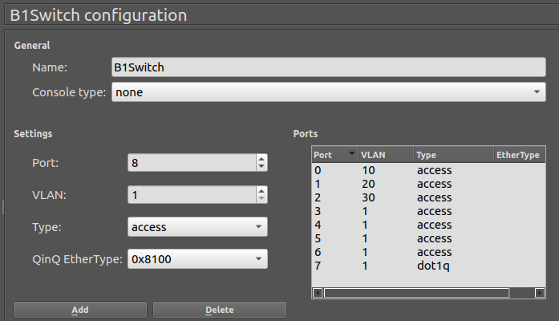

## VyOS

At the VyOS routers configure sub-interfaces for VLAN 10, 20 and 30 using the following commands:

```bash
configure

# N in ethN should be the number of the interface connected to the switch
set interfaces ethernet ethN vif 10
set interfaces ethernet ethN vif 20
set interfaces ethernet ethN vif 30
commit
save
```

Create three VXLAN connections between the VyOS, to carry data for each LAN:

```bash
set interfaces vxlan vxlan110 vni 110
set interfaces vxlan vxlan110 mtu 1500
set interfaces vxlan vxlan110 remote <remoteRouter_interfaceToCore_ip>

set interfaces vxlan vxlan120 vni 120
set interfaces vxlan vxlan120 mtu 1500
set interfaces vxlan vxlan120 remote <remoteRouter_interfaceToCore_ip>

set interfaces vxlan vxlan130 vni 130
set interfaces vxlan vxlan130 mtu 1500
set interfaces vxlan vxlan130 remote <remoteRouter_interfaceToCore_ip>

commit
save
```

Create three virtual bridges and add to each one the respective VXLAN interface and Ethernet sub-interface:

```bash
set interfaces bridge br210 member interface 'eth2.10'
set interfaces bridge br210 member interface 'vxlan110'

set interfaces bridge br220 member interface 'eth2.20'
set interfaces bridge br220 member interface 'vxlan120'

set interfaces bridge br230 member interface 'eth2.30'
set interfaces bridge br230 member interface 'vxlan130'

commit
save
```

## Analysis

We tested the system by placing an *ICMP* or Ping from VPC's `10.10.0.1` to `10.10.0.3`, connectivity was only possible between this two devices, as can be observed in the following image:

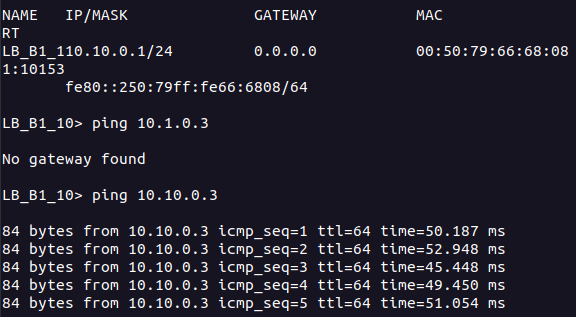

Analyzing the [capture 1](./captures/vxlan_vlan10_1_to_3_at_1.pcapng) after the VyOS router **RA1** and [capture 2](./captures/vxlan_vlan10_1_to_3_at_3.pcapng) between B3Switch and the destination VPC, we can observe that the all the exchange packets were encapsulated in *UDP* packets and sent across the network. Upon their reception at **RN1**, they were de-capsulated and sent to the respective VPC. Both ICMP and even ARP packet suffer are carried in this manner.

* Capture placed between **RA1** and **Aveiro**:
  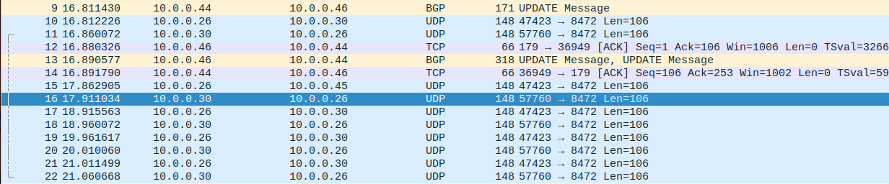
* Capture placed between **B3Switch** and VPC `10.10.0.3`
  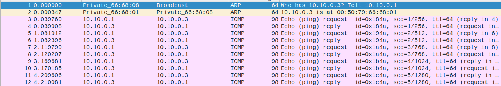

# L2-VPN

The Layer 2 multi-point VPN is configured to provide connectivity and serve Client A needs. For that end, The respective VPC's need to be configured, as well as VyOS routers **RN1**, **RL1** and **RA1**.

## VPC's

In the VPC's there's only the need to configure their respective IP addresses and masks. **Don't** configure a gateway.

## VyOS

The routers handling **L2-VPN** can't be Cisco C7200, because this ones don't support *l2vpn*, so the only option are VyOS routers.
From the base network configuration, we stated that VyOS routers located in the POP's establish BGP *ipv4 unicast* exchange with core-routers. However, in this case they need to establish BGP connection between themselves, as to exchange *l2vpn* data.
That's when the previous configuration with `peer-group core` and the `update-source ethN` came in handy, because this way we can separate the two BGP configuration, where one uses the loopback interface as source of the data to exchange with the other routers, while the other uses the physical connection to establish. Designing the network this way, allows the VyOS router to establish connection with the BGP core network and announce it's loopback interface, enabling the other VyOS routers to obtain the route to each others loopback's interfaces, as to exchange L2-VPN data.

In the topology of this network, the **RL1** is the Spine router, while **RA1** and **RN1** are Leafs or *route-reflector-client*'s. To configure the l2vpn address-family, in this topology, use the following commands:

```bash
# The following two configs. were already done before
set protocols bgp system-as 33900
set protocols bgp parameters router-id <loopback_ip>

set protocols bgp address-family l2vpn-evpn advertise-all-vni

# only for Router RL1 to add both neighbor
set protocols bgp neighbor 10.0.0.45 peer-group evpn
set protocols bgp neighbor 10.0.0.44 peer-group evpn

# only RN1 and RA1 should add RL1 as their neighbor
set protocols bgp neighbor 10.0.0.46 peer-group evpn


# Important step to configure dumN as the source of the data
set protocols bgp peer-group evpn update-source dumN
set protocols bgp peer-group evpn remote-as 33900
set protocols bgp peer-group evpn address-family l2vpn-evpn nexthop-self

# Only for RL1 router
set protocols bgp peer-group evpn address-family l2vpn-evpn route-reflector-client
```

Configure VXLAN and bridge interfaces in each router:

```bash
set interfaces vxlan vxlan101 source-address <loopback_ip>
set interfaces vxlan vxlan101 vni 101
set interfaces vxlan vxlan101 mtu 1500

set interfaces bridge br101 address 10.2.0.1/16
set interfaces bridge br101 description 'VLAN101'

# With N in ethN being the interface connected to the network
set interfaces bridge br101 member interface ethN
set interfaces bridge br101 member interface vxlan101
```

## Analysis

We tested the system by placing an *ICMP* or Ping from VPC's `10.2.1.1` to `10.2.3.1`, connectivity was only possible inside of the */16* network, as can be observed in the following image:

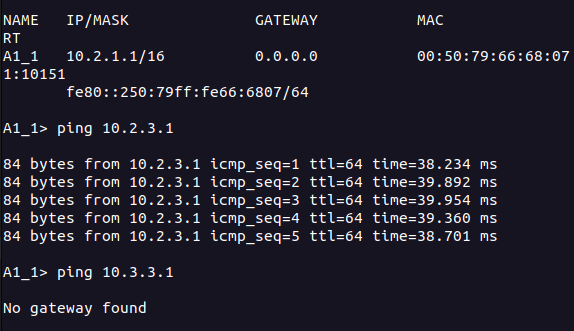

Analyzing the [capture 3](./captures/l2vpn_a1-1_a3-1_at_1.pcapng) after the VyOS router **RA1** and [capture 4](./captures/l2vpn_a1-1_a3-1_at_3.pcapng) between Switch3 and the destination VPC, we can observe that the results are similar to the *VXLAN* implementation, since all the exchange packets were encapsulated in *UDP* packets and sent across the network. Upon their reception at **RN1**, they were de-capsulated and sent to the respective Client A3 network and delivered to **A3_1** VPC. Both ICMP and even ARP packet suffer are carried in this manner.

* Capture placed between **RA1** and **Aveiro**:
  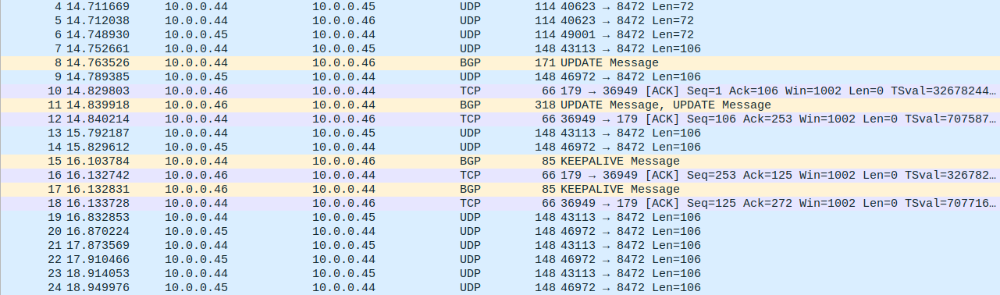
* Capture placed between **Switch3** and VPC `10.2.3.1`
  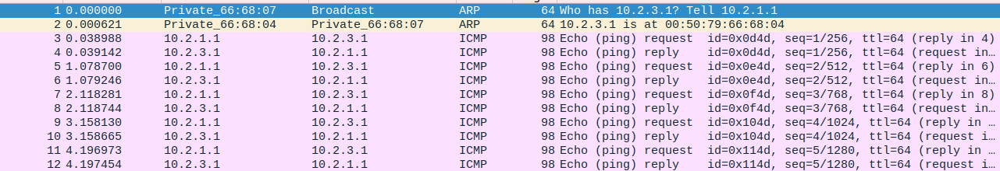

The difference between taking a Layer2 VPN approach as to using VLAN is that the connection is multi-point and we can establish more than one remote destination for the VLAN

# MPLS Layer 3 VPN

In terms of MPLS Layer 3 VPN, this one is configured to provide connectivity and address SMEx client needs. For that, the respective VPC's needed to be configured, as well as the core-routers and POP routers connected to the network.

## VPC

In the VPC's configure their respective IP addresses with mask and the gateway, which is the IP address of the interface in the router connected to the VPC.

## Core-Routers

In the core-routers, mpls needs to be enable in each interface to other core routers and to router **RM1**, **RA2** or **RL2**. Use the following command:

```bash
interface <interface-type><interface-number>
mpls ip
```

The router's BGP also needs to be configured to handle `address-family vpnv4`. The following commands can be used:

```bash
router bgp 33900
address-family vpnv4
neighbor <pop_router_ip> activate
neighbor <pop_router_ip>send-community extended
neighbor <pop_router_ip> route-reflector-client
```

## POP-Routers

The POP routers addressed in this subsection are **RM1**, **RA2** and **RL2**.

### Configure VRF

The first step in their configuration is to create a single VRF for **one** VPN instance:

```bash
ip vrf VPN-1
rd 200:1
route-target export 200:1
route-target import 200:1
```

Next step is to enable MPLS in the interface connected to the core-router. In this networks case:

```bash
interface FastEthernet0/0
ip address <ip-address> <subnet-mask>
mpls ip
no shutdown
```

After, vrf forwarding needs to be enabled in the interface connected do the SMEx network. Use the following commands:

```bash
interface FastEthernet0/1
ip vrf forwarding VPN-1
ip address <ip-address> <subnet-mask>
no shutdown
```

### Configure BGP

Check previous router configuration (`show run`) and execute the necessary following commands to attain a similar configuration:

```bash
router bgp 33900

# Add core router as neighbor
neighbor <coreRouter_interface_ip> remote-as 33900

# Configure IPV4 route address-family
address-family ipv4
# If the following command fails, don't worry, ignore it to use in the next section
network <SMEx_network_address> mask 255.255.255.0
neighbor <coreRouter_interface_ip> activate
exit

# Configure vpnv4 route address-family
address-family vpnv4
neighbor <coreRouter_interface_ip> activate
neighbor <coreRouter_interface_ip> send-community both
exit

# enable vrf
address-family ipv4 vrf VPN-1
redistribute connected
exit
```

### Global Routing

Until now, the router has two separate routing table which are isolated from each other. This can be observed by executing two commands:

```bash
show ip route
show ip route vrf VPN-1
```

The first one will show the global routing table, with access to all networks, while the second will show the virtual network, with only the connected interfaces and the SMEx network. This means that SMEx networks are isolated from the remaining network, so they can't traverse it to the various SMEx's.
To establish connection between the various SME's, with VRF, the following commands should be used:

```bash
# Add a default route from the VPN-1 to core-router using the global 
#  routing table to find the next-hop
ip route vrf VPN-1 0.0.0.0 0.0.0.0 <coreRouter_interface_ip> global

# Add a route to network SMEx to POP router global routing table. This
#  will enable the global routing table to access VRF VPN-1 table
ip route <SMEx_network_address> 255.255.255.0 FastEthernet0/1
```

In the case that the connected SMEx network wasn't added previously to BGP, use the following commands:

```bash
router bgp 33900
network <SMEx_network_address> mask255.255.255.0
```

## Testing Connectivity

At this point, MPLS Layer 3 VPN should be configured. To test connectivity with VRF's, use the `ping vrf` command:

```bash
# command only for C7200 routers
ping vrf VPN-1 <vrf-destination-ip>
```

To check MPLS LDP neighbors or LDP labels, use the following commands:

```bash
show mpls ldp neighbor
show mpls ldp bindings
show mpls interfaces
```

In terms of VRF, you can use the following command to check that the VPN-1 routing table is populated with the connected 10.0.x.0 network and has a default route:

```bash
show ip route vrf VPN-1
```

We tested the system by placing an *ICMP* or Ping from VPC's `10.0.1.1` to `10.0.2.1`, connectivity was only possible between the SME Clients.

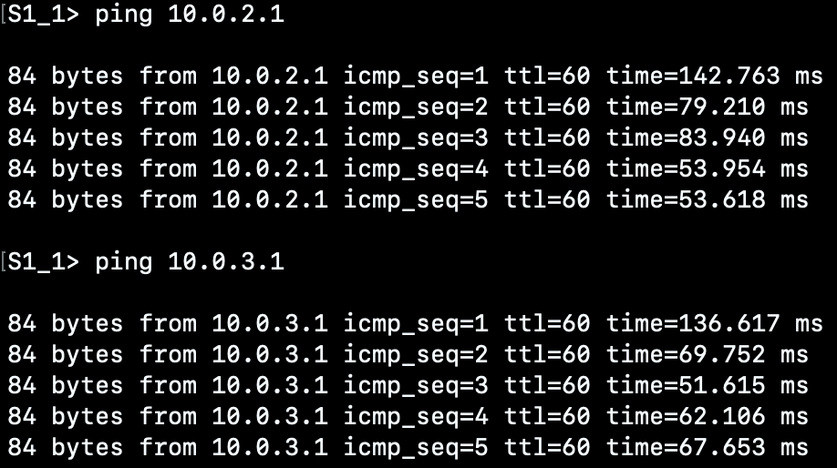

Analyzing the [capture 5](./captures/Aveiro_RA2.pcapng) after the router **RA2** and [capture 6](./captures/S2_Switch_S2_1VPC.pcapng) between S2_Switch and the destination VPC, we can observe that the all the exchange packets across the netwrok. The ICMP messages exchanged verifies the communication between the source (10.0.1.1) and the destination (10.0.2.1). Besides, the [ping](./image/MPLS/ping_betweeen_SME_Clients.png) performed above, illustrate not also the connection between SME1 and SME2, but also with SME3 (`10.0.3.1`).

* Capture placed between **RA2** and **Aveiro**:
  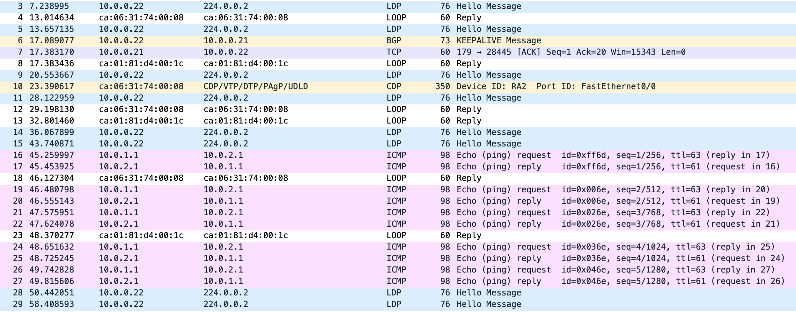
* Capture placed between **S2_Switch** and VPC `10.0.2.1` (S2_1)
  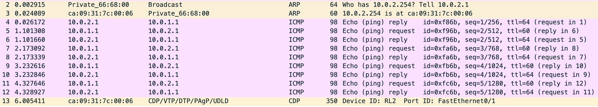

# Bandwidth reservation and usage/routing

Nextly, it will be presented the configuration of a load balancing solution for  Client LB traffic, using MPLS technology. The objective is to create a MPLS tunnel for client traffic  with a guaranteed bandwidth of 10 Mbps and priority, while also employing route based load balancing to ensure that client traffic is distributed equally.

1. Configure Core Interfaces:

   - Ensure the core interfaces have a guaranteed bandwidth of 10 Mbps to support the expected traffic load.

   ```bash
   mpls traffic-eng tunnels
   ip rsvp bandwidth 10000
   ```
2. Establish Dedicated MPLS Tunnel for New York - Aveiro Client Load Balancing

   - Configure MPLS Traffic Engineering (TE) for New York - Aveiro Path Selection (Client LB).

   ```bash
   interface TunnelX
   ip unnumbered Loopback0
   tunnel source Loopback0
   tunnel destination <destination-ip>
   tunnel mode mpls traffic-eng
   tunnel mpls traffic-eng priority 7 7
   tunnel mpls traffic-eng autoroute announce
   tunnel mpls traffic-eng bandwidth 10000
   tunnel mpls traffic-eng path-option 1 dynamic
   ```

   By having a MPLS tunnel, it is possible to isolate client traffic from other traffic flows, ensuring that client connections receive preferential treatment (priority).

   - Enable OSPF for Routing Updates and Path Discovery.

   ```bash
   router ospf 1
   mpls traffic-eng router-id Loopback0
   mpls traffic-eng area 0
   ```
3. Implement Route-Based Load Balancing for Client Traffic:

   - Traffic is routed through the MPLS tunnel and distributed across the New York and Aveiro data centers.

   ```bash
   route-map routeLCP permit 10
   match ip address 100
   set interface Tunnel1
   ```

   By applying a route map, it will be possible to route specific traffic flows trough the MPLS tunnel.
4. Testing:

   ```bash
   show ip route 10.0.0.4x
   show mpls forwarding
   show mpls traffic-eng tunnels
   ```

We tested the system by placing an *ICMP* or Ping from VPC's `10.10.0.3` to `10.10.0.1`, connectivity was possible between the Client LB.

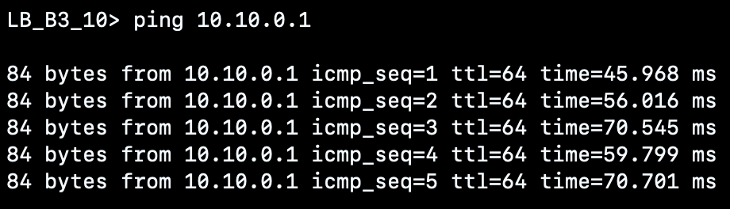

Analyzing the [capture 7](./captures/Aveiro_RA2.pcapng) after the router **RN1** and [capture 8](./captures/S2_Switch_S2_1VPC.pcapng) between B1_Switch and the destination VPC, we can observe that the all the exchange packets across the netwrok. The ICMP messages exchanged verifies the communication between the source (10.10.0.3) and the destination (10.10.0.1).

* Capture placed between **RN1** and **NEW York**:
  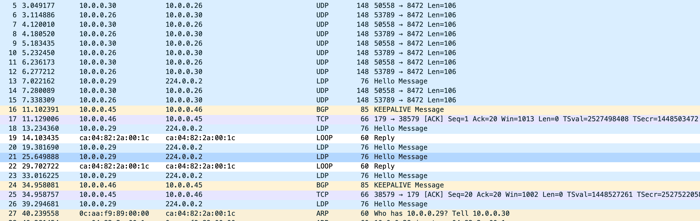
* Capture placed between **B1_Switch** and VPC `10.10.0.1` (S2_1)
  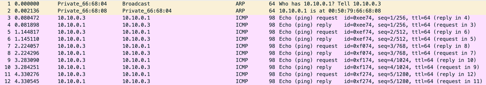

# Final Regards

The final configurations for all devices can be found in `configs` folder.
