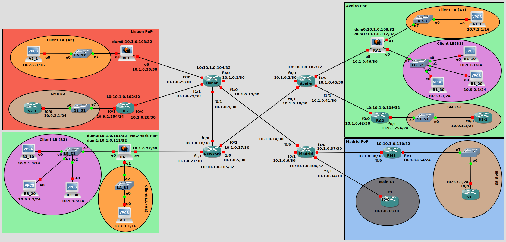
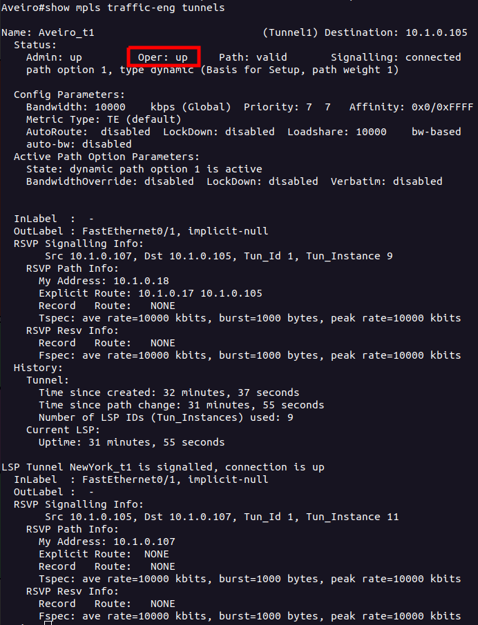
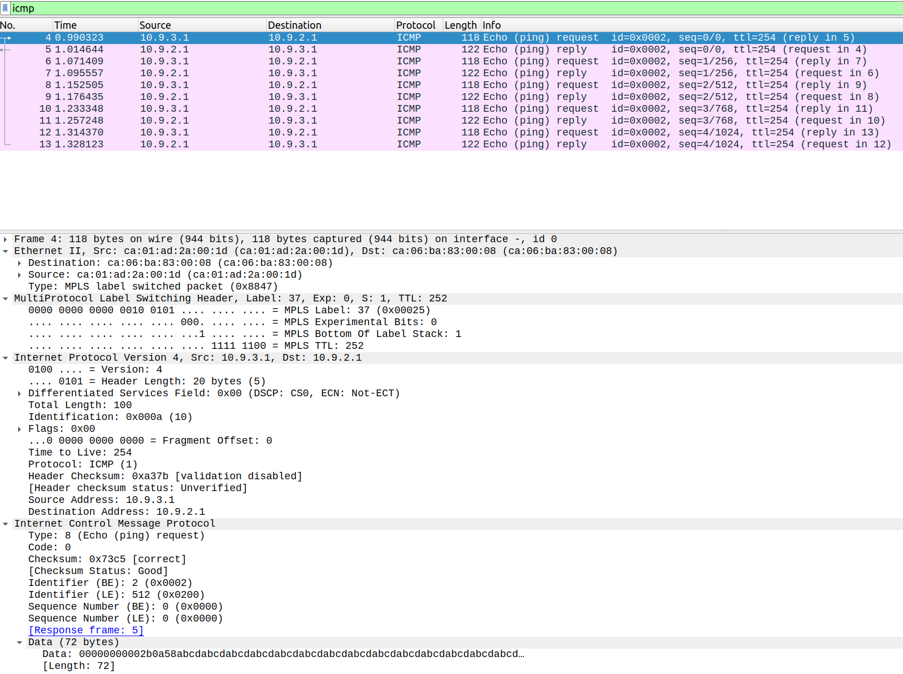
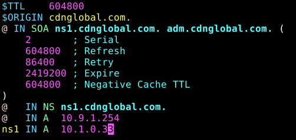
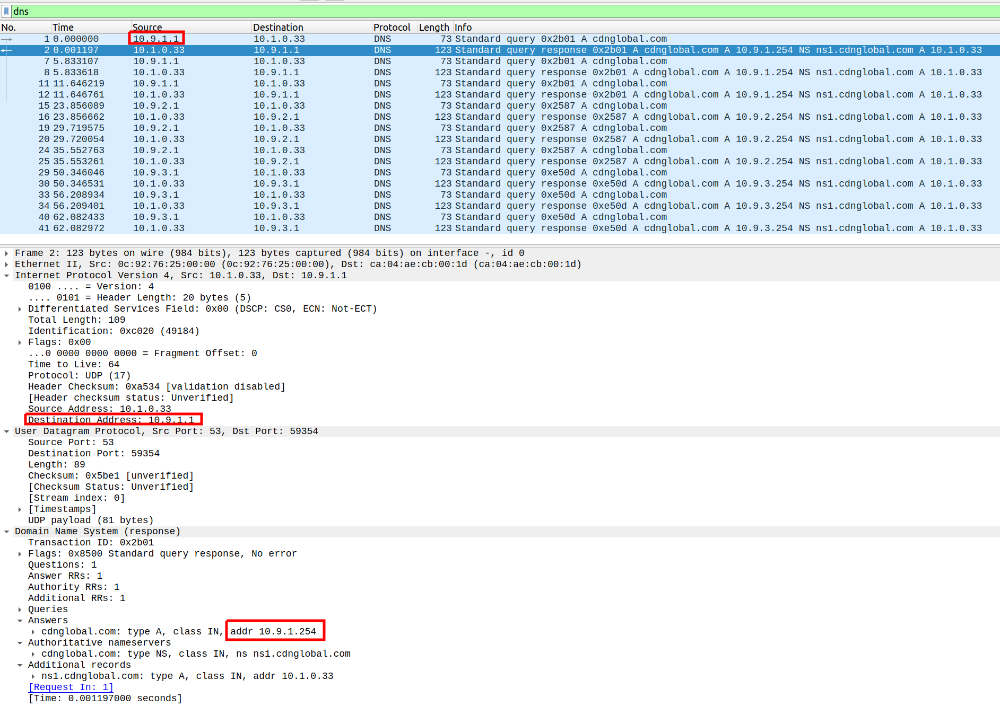
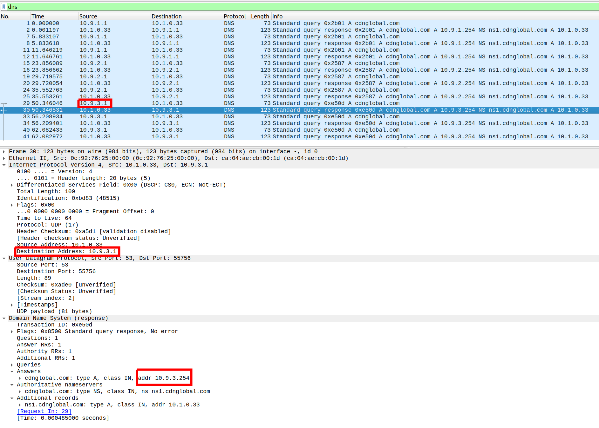

# Communication Architectures Project

Perform the technical design, configure and test a CDN network with multiple enterprise clients.
Authors:

* Gonçalo Silva, 103244

**Dealine:** 30/01/2024
**Presentation:** 30/01/2024, at 15h in room 4.3.30

# Interconnection Network

For the interconnection network, we subdivided it into two masks:

* Point-to-point connections, are defined with **/30** or **255.255.255.252** mask
* Loopback interface have **/32** or **255.255.255.255** mask assigned

The division of point-to-point networks can be viewed in the following table:

| Subnet       | Network IP | Usable Range           | Broadcast IP | Mask |
| ------------ | ---------- | ---------------------- | ------------ | ---- |
| 1            | 10.1.0.0   | 10.1.0.1 - 10.1.0.2    | 10.1.0.3     | 30   |
| 2            | 10.1.0.4   | 10.1.0.5 - 10.1.0.6    | 10.1.0.7     | 30   |
| 3            | 10.1.0.8   | 10.1.0.9 - 10.1.0.10   | 10.1.0.11    | 30   |
| 4            | 10.1.0.12  | 10.1.0.13 - 10.1.0.14  | 10.1.0.15    | 30   |
| 5            | 10.1.0.16  | 10.1.0.17 - 10.1.0.18  | 10.1.0.19    | 30   |
| 6            | 10.1.0.20  | 10.1.0.21 - 10.1.0.22  | 10.1.0.23    | 30   |
| 7            | 10.1.0.24  | 10.1.0.25 - 10.1.0.26  | 10.1.0.27    | 30   |
| 8            | 10.1.0.28  | 10.1.0.29 - 10.1.0.30  | 10.1.0.31    | 30   |
| 9            | 10.1.0.32  | 10.1.0.33 - 10.1.0.34  | 10.1.0.35    | 30   |
| 10           | 10.1.0.36  | 10.1.0.37 - 10.1.0.38  | 10.1.0.39    | 30   |
| 11           | 10.1.0.40  | 10.1.0.41 - 10.1.0.42  | 10.1.0.43    | 32   |
| 12           | 10.1.0.44  | 10.1.0.45 - 10.1.0.46  | 10.1.0.47    | 32   |
| **13**       | 10.1.0.48  | 10.1.0.49 - 10.1.0.50  | 10.1.0.51    | 32   |
| **14**       | 10.1.0.52  | 10.1.0.53 - 10.1.0.54  | 10.1.0.55    | 32   |
| **15**       | 10.1.0.56  | 10.1.0.57 - 10.1.0.58  | 10.1.0.59    | 32   |
| **16**       | 10.1.0.60  | 10.1.0.61 - 10.1.0.62  | 10.1.0.63    | 33   |
| ...          | ...        | ...                    | ...          | ...  |

The division of loopback networks can be viewed in the following table (they all start after address 100):

| Subnet       | Network IP | Usable Range | Mask |
| ------------ | ---------- | ------------ | ---- |
| 1            | 10.1.0.101 | 10.1.0.101   | 32   |
| 2            | 10.1.0.102 | 10.1.0.102   | 32   |
| 3            | 10.1.0.103 | 10.1.0.103   | 32   |
| 4            | 10.1.0.104 | 10.1.0.104   | 32   |
| 5            | 10.1.0.105 | 10.1.0.105   | 32   |
| 6            | 10.1.0.106 | 10.1.0.106   | 32   |
| 7            | 10.1.0.107 | 10.1.0.107   | 32   |
| 8            | 10.1.0.108 | 10.1.0.108   | 32   |
| 9            | 10.1.0.109 | 10.1.0.109   | 32   |
| 10           | 10.1.0.110 | 10.1.0.110   | 32   |
| 11           | 10.1.0.111 | 10.1.0.111   | 32   |
| 12           | 10.1.0.112 | 10.1.0.112   | 32   |
| **13**       | 10.1.0.113 | 10.1.0.113   | 32   |
| ...          | ...        | ...          | ...  |

# Configuring the network

In this section, we'll be approaching the configuration of IP addresses and base routing protocols to achieve connectivity. Specific network and devices, including VPC's will be approached later.

## IP's

The layout of the network, as well as the assigned IP addresses for each interface and device can be viewed in the following image:


The IP addresses of the interconnection and loopback interfaces are derived from the division in the table above, and in the case of private or reserved network, only one address was needed to be assigned to one terminal (router or VPC).

To configure an interface IP address in a Cisco C7200, the following commands can be used:

* For serial interfaces:

```bash
interface <interface-type>/<interface-number>
ip addr <ip_address> <mask>
```

* For Loopback interfaces:

```bash
interface loopback <N>
ip addr <ip_address> <mask>
```

In the case of VyOS routers, the configuration is a bit different. When `N` is present in the command, it means that a number needs to be assigned to the interface:

* For serial interfaces:

```bash
configure
set interfaces ethernet ethN address <ip_address>/<mask>
set system host-name <router_name>
commit
save
```

* For Loopback interfaces:

```bash
configure
# Loopback/dummy interfaces need to be named dumN
set interfaces dummy dumN address <ip_address>/<maks>
commit
```

**NOTE:** Before configuring interfaces, check correct interfaces which are **eht0** - **eth5**, with the following command:

```bash
ip addr
```

If some of those interfaces aren't present, use the next command to load them:

```bash
sudo cp /opt/vyatta/etc/config.boot.default /config/config.boot
reboot
```

## OSPF

OSPF is used in the interconnection of all routers, especially to announce the loopback interfaces of the routers, which are then used to establish connection with other protocols (BGP).
The following sub-sections will describe how to create the OSPF process and add the interfaces, both for Cisco C7200 routers, as well as VyOS:

### Cisco C7200

Use the following command to configure the serial interfaces:

```bash
interface f0/0
ip ospf 1 area 0
```

Execute the following command and use the loopback ip of the router as the `router-id`:

```bash
router ospf 1
router-id <loopback-ip>

## Add a specific network, if needed
network <network-ip> <mask> area 0
```

To verify connection with neighbors, use the following command:

```bash
show ip ospf neighbors
```

### VyOS

Execute the following commands for every interface and use the loopback ip of the router as the `router-id`:

```bash
configure
# Sets the router-id of the ospf process
set protocols ospf parameters router-id <loopback-ip>
# Explicitly add a network to the process
set protocols ospf area 0 network <network-IP>/<subnet-mask>
commit
save
```

### Analysis

With the system configured, networks are being exchanged throughout the system, making so that every router has access to and only to the interconnection networks. We can observe that in the following images, which show the **Lisbon** router *ip route* table and ospf neighbors:


## BGP

All routers use the loopback interfaces to establish BGP connection (router-id) between them. This was done as to guarantee that if an interface was disconnected, BGP would still work, with the traffic being routed by another interface connected to the core-router.
Our BGP network structure relies on a **spine** and **leaf** architecture, with all core-routers interconnected (spines), establishing a *Full-mesh*. The remaining routers in each POP are leafs or **route-reflector-client**'s.

Configuring BGP in the core-routers can be done the following way:

```bash
router bgp 33900
bgp router-id [loopback_ip]

# Adding another core or POP as neighbor
neighbor [neighbor-ip] remote-as [same-AS-number]

address-family ipv4 unicast

# Make OSPF routes available in BGP
redistribute ospf 1

# Explicitly add a network, if needed
network [network_address] mask [mask]

# Force source address to be loopback in the connection
neighbor [neighbor-ip] update-source l0

# Core routers should configure PoP routers asLeafs
neighbor [neighbor-ip] route-reflector-client
```

Configuration of BGP in the POP routers:

```bash
router bgp 33900
bgp router-id [interface_coreRouter_ip]

# Adding core as neighbor
neighbor [neighbor-ip] remote-as [same-AS-number]
# Force source address to be loopback in the connection
neighbor [neighbor-ip] update-source l0
```

The configuration for BGP in the VyOS routers located in the POP's is done with the use of a specific peer-group, as to not interfere with future additions. The commands are as follows:

```bash
set protocols bgp system-as 33900
# Configure router-id
set protocols bgp parameters router-id <loopback_ip>
# Add a core-router neighbor
set protocols bgp neighbor <neighbor_ip|interface> peer-group core
# Configuration the peer-group settings
# Important step to make the source of the traffic ethN
set protocols bgp peer-group core update-source dumN
set protocols bgp peer-group core remote-as 33900
set protocols bgp peer-group core address-family ipv4-unicast nexthop-self
set protocols bgp address-family ipv4-unicast redistribute ospf
```

### Testing

After using the above steps, use the following commands to check if the BGP neighbors are up and exchanging routing information:

```bash
# Check BGP neighbors
show bgp summary

# Check if all routes are appearing in the routing table
Show ip routes
```

### Analysis

Having the system configured, IPV4 unicast routes exchanging should be working, between all the routers configured. The following image shows the `bgp summary` of **New York** router. In there we can see that the BGP connection is established and working between loopback interfaces, with router **RN1** (*leaf*) and the remaining core routers (*spines*)


# Layer 2 point-to-point (vxlan)

Layer 2 point-to-point is configured to provide connectivity and serve the Client B needs. For that, the respective VPC's and Switches need to be configure, as well as the VyOS routers **RN1** and **RA1**.

## VPC's

In the VPC's there's only the need to configure their respective IP addresses and masks. **Don't** configure a gateway.

## Layer 2 Switches

Each switch is connected to three VPC's in different VXLAN's. Their connection with the VyOS routers is done using a **802.1Q trunk** (dot1q). The configuration in the switches can be seen in the following image:


## VyOS

At the VyOS routers start by creating a new loopback interface l1 and add it to OSPF only used to carry VXLAN traffic:

```bash
configure
# Loopback/dummy interfaces need to be named dumN
set interfaces dummy dum1 address <ip_address>/<maks>
set protocols ospf area 0 network <network-IP>/<subnet-mask>
commit
``` 


configure sub-interfaces for VLAN 10, 20 and 30 using the following commands:

```bash
configure

# N in ethN should be the number of the interface connected to the switch
set interfaces ethernet ethN vif 10
set interfaces ethernet ethN vif 20
set interfaces ethernet ethN vif 30
commit
save
```

Create three VXLAN connections between the VyOS, to carry data for each LAN:

```bash
set interfaces vxlan vxlan110 vni 110
set interfaces vxlan vxlan110 mtu 1500
set interfaces vxlan vxlan110 remote <remoteRouter_loopback_l1_ip>

set interfaces vxlan vxlan120 vni 120
set interfaces vxlan vxlan120 mtu 1500
set interfaces vxlan vxlan120 remote <remoteRouter_loopback_l1_ip>

set interfaces vxlan vxlan130 vni 130
set interfaces vxlan vxlan130 mtu 1500
set interfaces vxlan vxlan130 remote <remoteRouter_loopback_l1_ip>

commit
save
```

Create three virtual bridges and add to each one the respective VXLAN interface and Ethernet sub-interface:

```bash
# Watch the interface used, they start with 0, because the connected 
#  interface is eth0
set interfaces bridge br010 member interface 'eth0.10'
set interfaces bridge br010 member interface 'vxlan110'

set interfaces bridge br020 member interface 'eth0.20'
set interfaces bridge br020 member interface 'vxlan120'

set interfaces bridge br030 member interface 'eth0.30'
set interfaces bridge br030 member interface 'vxlan130'

commit
save
```

## Analysis

With the system configured, we made a `ping` test with Client LB *B1_10* VPC, to *B3_10* VPC, with addresses `10.9.1.1` and `10.9.1.3` respectively. The terminal output with the successful connection can be seen in the following image:


To analyze the exchanged data, we set-up two Wireshark captures, one between **RN1** and **NewYork**, before the data is de-capsulated by **RN1** and another between **RA1** and **LA_S2** switch, so that the VXLAN original traffic can be seen


As we can see *ICMP* packets are encapsulated in **UDP** packets, operating in port 8472. This port isn't the standard 4789, because it's the standard designated by VyOS. Analyzing, we can also see the 802.1Q  VLAN tag ID present in the de-capsulated *ICMP* packet, in this case it's **VLAN 10**

# VXLAN Bandwidth reservation and usage/routing

To fulfill the requirement demanded by client LB of 10 Mbps of guaranteed bandwidth and priority, we started by creating an MPLS traffic-eng tunnel between New York and Aveiro. This tunnel is used so that any VXLAN traffic by Client LB is routed with priority through it. Naturally this also requires configurations on the remaining routers to be able to communicate traffic engineering information.

## Initial configuration in core-routers

Firstly, we'll configure the interfaces connected between the core-routers to have a guaranteed bandwidth of 10 Mbps, enabling the support of the expected traffic. The commands are as follows:

```bash
# enable mpls tunnels globally
mpls traffic-eng tunnels

interface <interface-type>/<interface-number>
mpls traffic-eng tunnels
ip rsvp bandwidth 10000
```

## Creating the tunnel

Since Client LB is only present present in routers **RN1** and **RA1**, which connect to *NewYork* and *Aveiro* routers, only one tunnel needs to be established between this two core-routers, which will do Load Balancing and place higher priority in VXLAN traffic.

For creating the tunnel, the following commands can be used:

```bash
interface Tunnel1
ip unnumbered Loopback0
tunnel source Loopback0
# target should be loopback of New York or Aveiro routers
tunnel destination <loopback_target-ip>
tunnel mode mpls traffic-eng
# announce the tunnel to the routing table
#tunnel mpls traffic-eng autoroute announce
tunnel mpls traffic-eng priority 7 7
tunnel mpls traffic-eng bandwidth 10000
tunnel mpls traffic-eng path-option 1 dynamic # use dynamic routing
```

Use the next commands to enable OSPF for Routing Updates and Path Discovery:

```bash
router ospf 1
mpls traffic-eng router-id Loopback0
mpls traffic-eng area 0
```

## Forwarding traffic through the tunnel

Since dynamic routing of traffic was opted, using *Access-control lists* and *route-maps* is possible to isolate client LB traffic from other traffic flows, ensuring that their data is routed by the tunnel.

First we need to create the *access-list* 100 to allow traffic coming from **RN1** to **RA1** and vice-versa. Since client LB only uses VXLAN, which in VyOS uses the port **8472**, makes the rule easier to configure. Since we also divided the VxLAN and L2VPN in one using dum1 and the other dum0 respectively, it's easier to filter the data now, by using the correct dummy interface. Use The following commands to create the *access-list*:

```bash
# source and dest ip should be RN1 interface to core and RA1 loopback or vice-versa
access-list 100 permit udp host <source_ip> host <dest__dum1_ip> eq 8472
```

Next, a *route-map* is needed to filter the traffic and see which applies to the *access-list*. For that, we created the **routeXPRESS** which will *match* the traffic to the **ACL 100** and forward them to *Tunnel 1*. Use the following commands:

```bash
route-map routeXPRESS permit 10
match ip address 100
set interface Tunnel1
```

The last step is to apply the *route-map* as a policy to the interface connected to **RN1** and **RA1**, so that the traffic coming originating from those routers is filtered with **routeXPRESS**. The following commands can be used

```bash
interface <interface-type>/<interface-number>
ip policy route-map routeXPRESS
``` 

## Testing

The following commands can be used to debug if the tunnel is established and working:

```bash
show mpls forwarding
show ip interface brief
# Next command should show ...Oper: Up...
show mpls traffic-eng tunnels
show access-list 100
show route-map routeXPRESS
show interface tunnel1
# See tunnel path
show mpls traffic-eng tunnels brief
```

## Analysis

The following image contains the forwarding labels and Pop actions present in **Aveiro** router:


After setting up the system, we check the status of the tunnels, as present in the following image, which shows that they are operating since `oper` is `up`:



As executed above, we made a `ping` test with Client LB *B1_10* VPC, to *B3_10* VPC, with addresses `10.9.1.1` and `10.9.1.3` respectively, then place a Wireshark capture between routers **NewYork** and **Aveiro**. The result of this capture can be seen below:


In this capture, we can see that the **UDP** **VxLAN** packet operating in port 8472 is being routed by the *MPLS* tunnel traffic-eng tunnel.

# L2-VPN

The Layer 2 multi-point VPN is configured to provide connectivity and serve Client A needs. For that end, The respective VPC's need to be configured, as well as VyOS routers **RN1**, **RL1** and **RA1**.

## VPC's

In the VPC's there's only the need to configure their respective IP addresses and masks. **Don't** configure a gateway.

## VyOS

The routers handling **L2-VPN** can't be Cisco C7200, because this ones don't support *l2vpn*, so the only option are VyOS routers.
From the base network configuration, we stated that VyOS routers located in the POP's establish BGP *ipv4 unicast* exchange with core-routers. However, in this case they need to establish BGP connection between themselves, as to exchange *l2vpn* data.
Using the previous configuration with `peer-group core` is easy to now establish a new peer-group to communicate over **EVPN**.

In the topology of this network, the **RL1** is the Spine router, while **RA1** and **RN1** are Leafs or *route-reflector-client*'s. To configure the *l2vpn address-family*, in this topology, use the following commands:

```bash
# The following two configs. were already done before
set protocols bgp system-as 33900
set protocols bgp parameters router-id <loopback_ip>

set protocols bgp address-family l2vpn-evpn advertise-all-vni

# only for Router RL1 to add both neighbor
set protocols bgp neighbor 10.1.0.101 peer-group evpn # Add RN1
set protocols bgp neighbor 10.1.0.108 peer-group evpn # Add RA1

# only RN1 and RA1 should add RL1 as their neighbor
set protocols bgp neighbor 10.1.0.103 peer-group evpn


# Important step to configure dum0 as the source of the data
set protocols bgp peer-group evpn update-source dum0
set protocols bgp peer-group evpn remote-as 33900
set protocols bgp peer-group evpn address-family l2vpn-evpn nexthop-self

# Only for RL1 router
set protocols bgp peer-group evpn address-family l2vpn-evpn route-reflector-client
```

Configure VXLAN and bridge interfaces in each router:

```bash
set interfaces vxlan vxlan101 source-address <loopback_ip>
set interfaces vxlan vxlan101 vni 101
set interfaces vxlan vxlan101 mtu 1500

set interfaces bridge br101 address 10.7.<Area>.254/16
set interfaces bridge br101 description 'VLAN101'

# With N in ethN being the interface connected to the network
set interfaces bridge br101 member interface ethN
set interfaces bridge br101 member interface vxlan101
```

## Analysis

The following captures demonstrate a `ping` test made between VPCs *a1_1* and *a2_1*, with addresses `10.7.1.1` and `10.7.2.1`, respectively. The result was successful and the terminal output can be seen in the following image:


A packet capture was placed using Wireshark, between **Lisbon** and **RL1**, where the data is still encapsulated in **UDP** packets, with port 8472 and another capture between router **RA1** and Switch **LA_S3**, where the *ICMP* packets originate, before being encapsulated.


# MPLS Layer 3 VPN

In terms of MPLS Layer 3 VPN, this one is configured to provide connectivity and address SMEx client needs, all while keeping an isolated virtual routing table. For that, the respective VPC's needed to be configured, as well as the core-routers and POP routers connected to the network.

## Terminals

To simulate a user device, a Cisco C7200 router was used in each SME network. To configure the router properly, the following commands should be used:
```bash
no ip routing
ip default gateway <ip_address>
int <interface-type>/<interface-number>
ip address <ip_address> <mask>
no sh
```

## Core-Routers

In the core-routers, mpls needs to be enabled in each interface to other core routers and to router **RM1**, **RA2** or **RL2**. Use the following command:

```bash
interface <interface-type>/<interface-number>
mpls ip
```

In our case, core-routers continue to establish OSPF and BGP IPV4 connection with this routers, for route exchange, however, they are still *leafs*.

## PoP-Routers

The POP routers addressed in this subsection are **RM1**, **RA2** and **RL2**. They need to be configured to handle `address-family vpnv4`. The following commands can be used:

```bash
router bgp 33900
address-family vpnv4
# Use the router-ids of the other routers
neighbor <pop_router_ip> activate
neighbor <pop_router_ip> send-community both
```

In this connection, no route-reflector is used, because there are only 3 routers and this way, we can improve redundancy where if one of the routers fail, the others can still communicate effectively, without having one which can't fail.

### Configure VRF

The first step in their configuration is to create a single VRF for **one** VPN instance:

```bash
ip vrf VPN-1
rd 200:1
route-target export 200:1
route-target import 200:1
```

Next step is to enable MPLS in the interface connected to the core-router. In this networks case:

```bash
interface FastEthernet0/0
ip address <ip-address> <subnet-mask>
mpls ip
no shutdown
```

After, vrf forwarding needs to be enabled in the interface connected do the SMEx network. Use the following commands:

```bash
interface FastEthernet0/1
ip vrf forwarding VPN-1
ip address <ip-address> <subnet-mask>
no shutdown
```

### Configure BGP

Check previous router configuration (`show run`) and execute the necessary following commands to attain a similar configuration:

```bash
router bgp 33900

# Configure router id, if not before
bgp router-id <loopback_ip>

# Add core router as neighbor
neighbor <neighbor_id> remote-as 33900
neighbor <neighbor_id> update-source l0

# Configure IPV4 route address-family
address-family ipv4
neighbor <coreRouter_neighbor> activate
exit

# Configure vpnv4 route address-family
address-family vpnv4
neighbor <pop_router_target_ip> activate
neighbor <pop_router_target_ip> send-community both
exit

# enable vrf
address-family ipv4 vrf VPN-1
redistribute connected
exit
```

## Debugging

Until now, the router has two separate routing table which are isolated from each other. This can be observed by executing two commands:

```bash
show ip route # Should only appear the interconnection networks
show ip route vrf VPN-1 # should only appear the SME networks
```

## Analysis

After configuring our system, we conducted a `ping` test between terminals `S3_1` and `S2_1`, which have the respective ip address `10.9.3.1` and `10.9.2.1`. The terminal output and connectivity of this test can be seen the following image:


To analyze the traffic, we configured Wireshark packet capture between routers **RL2** and **Lisbon**, before the traffic arrived at the destination router at the edge of the client network and between router **RM1** and Switch **S3_S1**, capturing the originating *ICMP* packets.




In this packets, we can see that the packets are forwarded through the networks using the **MPLS** protocol, operating in Layer 3.

The following images also show the terminal of **RM1** router, where it's possible to see the `ip route` of the psychical routing table and virtual `vrf VPN-1` routing table, where the physical table only contains the interconnection network and the virtual only the client **SME** networks. This way the client get's an isolated routing table.


# Geographic based service routing

This section will attend to client SMEx needs of geographic based service routing for its servers/services. In practice this translates to a DNS server located in main DC which will be the target of client requests and supply them with a dummy or the gateway IP address associated to their respective PoP.

## Terminals

For increased reliability with DNS requests, we'll be using Cisco C7200 routers as the client (already configured in MPLS section), with routing disabled. To configure the terminal routers, use the following commands:

```bash
# Already done before
no ip routing
ip default-gateway <gateway_ip>
int <interface-type>/<interface-number>
ip address <ip_address> <mask>
no shutdown

# New commands
ip name-server 10.1.0.33
ip domain lookup
```

## DNS Server

Using Qemu and `labcom`, we started by defining the GeoLocation of the respective IP addresses associated to the PoP. The ACL list is as follows:

```bash
acl Aveiro {
	10.9.1.0/24;
};

acl Lisbon {
	10.9.2.0/24;
};

acl Madrid {
	10.9.3.0/24;
};
```

This file should be named `GeoIP.acl` and present in the directory `/etc/bind/`. Next, create bind the ip address and gateway to the connection:

```bash
# Bind the ip address to the ens3 interface
sudo ip addr add 10.1.0.33/30 dev ens3
# Assign a gateway
sudo ip route add default via 10.1.0.34
```

On the DNS server, load the **ACL** file to *BIND* the configuration by adding the following line to `/etc/bind/named.conf` (If present, comment the line `include “/etc/bind/named.conf.default-zones”;`):
```bash
include “/etc/bind/GeoIP.acl”;
```

The file will have the following structure:


Then restart the DNS server with the command:
```bash
service bind9 restart or systemctl restart bind9.
# check it's status
service bind9 status 
systemctl status bind9
```

Modify file `/etc/bind/named.conf.local` by creating the definition of *zones* conditioned by *views*, dependent on the geographic location obtained from the **ACL**. The additions are present in the following image:


To create the IP addresses of the servers present in each location, we created one `.db` file for each location and another for open access. In our case, since we don't have a dedicated copy server (not in scope), we just simply returned the address of the gateway present in this network. In the following images, we have present the configuration of each file:

* DNS database file of Aveiro SME1 network:
    

* DNS database file of Lisbon SME2 network:
    

* DNS database file of Madrid SME3 network:
    

* DNS database file for any access:
    

To check the successful configuration of the addresses, use the command:

```bash
named-checkzone cdnglobal.com /etc/bind/cdnglobal.com-<zone>.db
```

Finally, restart the server and the system is configured.

## Other routers

Since SMEx network operate in a MPLS Layer3 network with isolated routing, they can't natively access devices outside of their network. However, in this case, they need to access the DNS server in order to resolute the address of the website `cdnglobal.com`. For that, in routers **RM1**, **RL2** and **RA2**, a static default route needed to be created in the virtual routing table (`vrf VPN-1`) as to give the ability of this network to access the global physical routing table. The command used is as follows:

```bash
# Add a default route from the VPN-1 to core-router using the global 
#  routing table to find the next-hop
ip route vrf VPN-1 0.0.0.0 0.0.0.0 <coreRouter_interface_ip> global
```

Since the scope of this sections was just to have the address resolved and seen by Wireshark, a return path wasn't configured, which means that the terminals are able to reach the **DNS** server, however, the server doesn't have the routes to their network, so they won't be able to see the resolution. Still, that resolution can be observed in the Wireshark packets as we'll be approaching in the next section. 

Static routes from the global routing table to the virtual, distributed by OSPF could be configured ot solve this issue, however this would quickly prove to be a bad idea, because the SMEx networks would start to be seen as internal to the AS infrastructure, allowing other users or bad actors access. Of course other measures could be used, such as only allowing DNS traffic with **ACL**'s, or using another dedicated *VPN* to carry only traffic outside of the clients networks and back. This and other approaches could be used, however, as stated before this part of the work falls out-of-scope of this project.

## Analysis

To test the successful implementation of our DNS system, we performed a packet capture using Wireshark in the link between **Madrid** router and the **DNS** server. Next, we made a `ping` test to address `cdnglobal.com`, filtered by the **DNS** response packet and checked the `Answers` field, which contains the address returned by the **DNS** server. As present in the following images, our system performed as expected, returning the correct server address for all requests.

* Test from Aveiro:
    

* Test from Lisbon:
    

* Test from Madrid:
    
